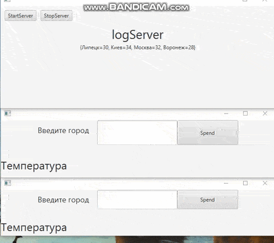

# ServerMeteo
Client-Server MeteoServer
**Описание**: Клиент серверное приложение выполняющее две задача:
1) получает температуру в городе с сервера
2) если температура города неизвеста, то передёт температуру на сервер

**Стек технологий**:
Java 17, JavaFX13

**Сборка**
maven

**Статус**:  Alpha 1.1

**Скриншоты**

